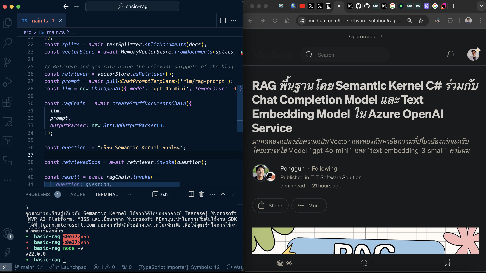
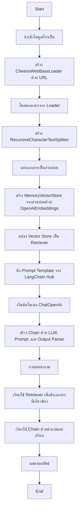

# จุดประสงค์ของโปรแกรม
**วัตถุประสงค์ของโค้ด:**

โค้ดนี้สร้างระบบ **Retrieval-Augmented Generation (RAG)** โดยดึงข้อมูลจากบทความบนเว็บและใช้ข้อมูลนั้นเพื่อช่วยในการตอบคำถามของผู้ใช้ด้วยโมเดลภาษาของ OpenAI

**การทำงานของ RAG ในโค้ดนี้:**

1. **Data Retrieval:**
   - ใช้ `CheerioWebBaseLoader` เพื่อโหลดเนื้อหาจาก URL ที่กำหนด
   - เนื้อหาถูกแบ่งเป็นส่วนย่อย (chunks) ด้วย `RecursiveCharacterTextSplitter`

2. **Vectorization:**
   - ใช้ `OpenAIEmbeddings` เพื่อแปลง chunks เป็น embeddings
   - เก็บ embeddings ใน `MemoryVectorStore`

3. **Relevant Information Retrieval:**
   - สร้าง retriever จาก vector store เพื่อค้นหา chunks ที่เกี่ยวข้องกับคำถาม

4. **Answer Generation:**
   - ใช้โมเดล `ChatOpenAI` (เช่น `gpt-4o-mini`) และ prompt template จาก `LangChain Hub`
   - สร้างคำตอบโดยใช้ข้อมูลที่เกี่ยวข้องจาก retriever

**ดึงข้อมูลจาก:**

- บทความบนเว็บที่ URL: [RAG พื้นฐานโดย Semantic Kernel C# ร่วมกับ Chat Completion Model และ Text Embedding Model ใน Azure OpenAI Service](https://medium.com/t-t-software-solution/rag-พื้นฐานโดย-semantic-kernel-c-ร่วมกับ-chat-completion-model-และ-text-embedding-model-ใน-azure-9a86f606c225)

**ภาษาและ Libraries ที่ใช้:**

- **ภาษา:** JavaScript (ES6 Modules)
- **Libraries:**
  - `cheerio`: สำหรับการดึงข้อมูลจากเว็บเพจ (web scraping)
  - `dotenv/config`: สำหรับการจัดการ environment variables
  - `@langchain/community` และ `@langchain/core`: สำหรับ document loading, text splitting, vector stores, และ chains
  - `langchain/hub`: สำหรับดึง prompt templates
  - `OpenAI`: สำหรับ embeddings และ language models

**AI Model ที่ใช้:**

- **ChatOpenAI** กับโมเดล `gpt-4o-mini` และค่า temperature ที่ 0 เพื่อให้ได้คำตอบที่แม่นยำและสอดคล้องกับบริบท

# ตัวอย่างผลลัพธ์

# อธิบายการทำงาน

# แหล่งอ้างอิง
https://js.langchain.com/docs/tutorials/rag/#indexing-load

from template: https://github.com/thaitype/minimal-typescript-node-esm-starter